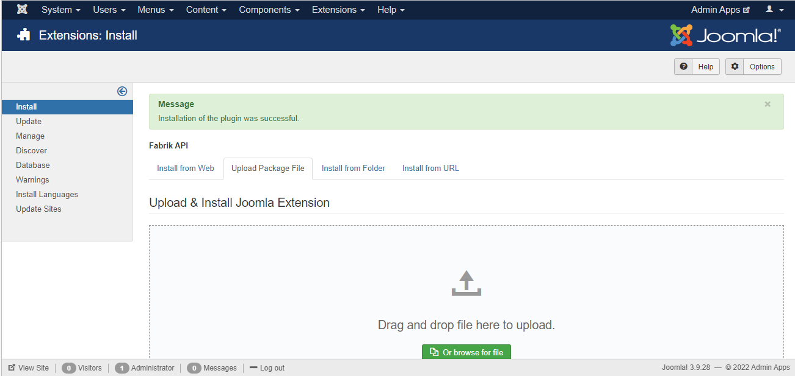
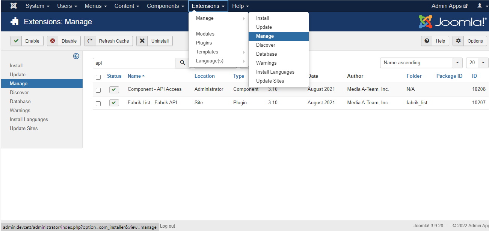
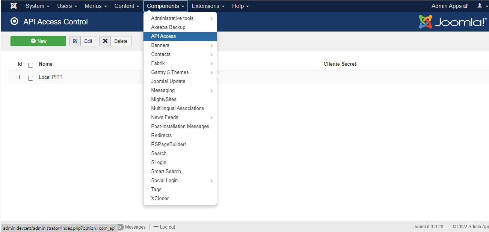
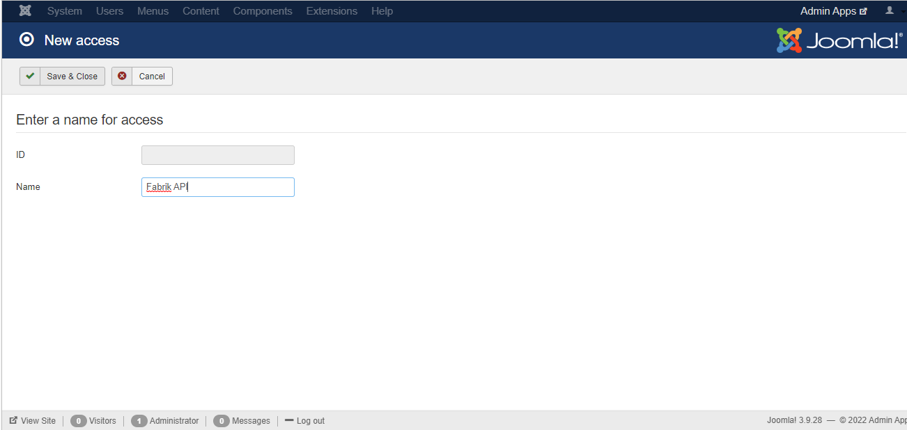
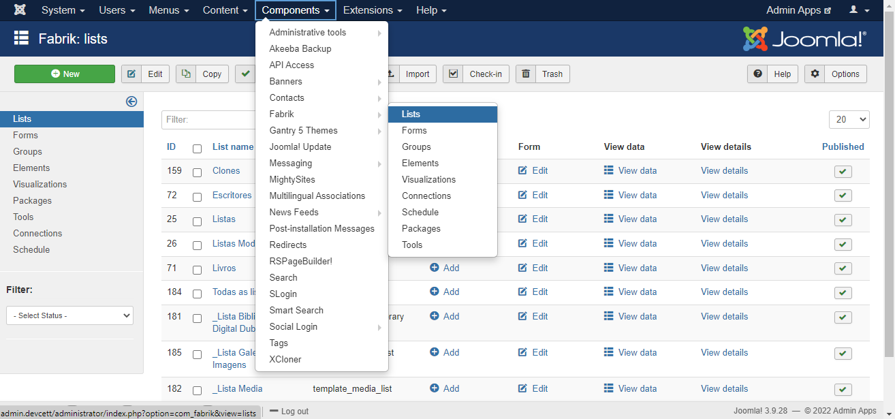
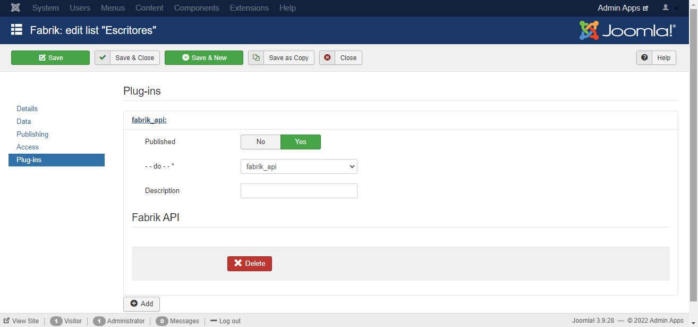
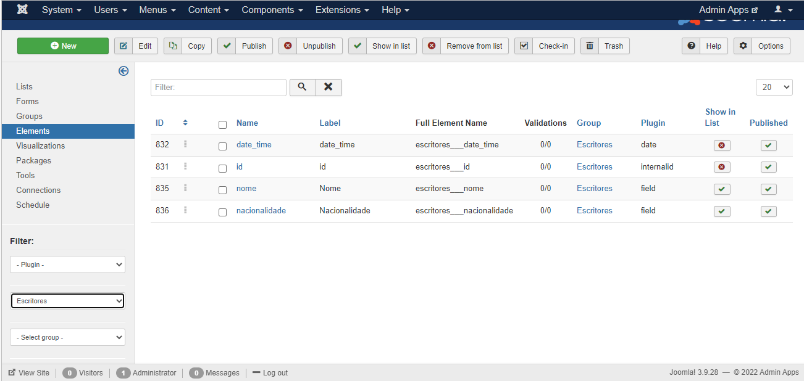

# Fabrik API

## Instalação

<p style="text-align: justify">Primeiramente, deve-se instalar o plugin principal de funcionamento, fabrik_api, e seu componente auxiliar, com_api. Para isso, em sua tela de administrador do Joomla vá em Extensions->Manage->Install e clique na aba Upload Package File como na imagem abaixo.</p>


</br>

<p style="text-align: justify">Após isso, basta navegar aos arquivos .rar das duas extensões necessárias e arrastar para a caixa de seleção, se ocorrer tudo como esperado na instalação o resultado deve ser o seguinte.</p>

 


## Configurações Inicias

<p style="text-align: justify">Após a instalação é preciso realizar duas etapas de configurações e verificações básicas para o correto funcionamento da API.</p>

</br>

<b>1. Verificar se as extensões instaladas estão habilitadas.</b>
<p style="text-align: justify">Para isso vá em Extensions->Manage->Manage e na aba de pesquisa digite "API" e clique enter, como na imagem abaixo. Ao aparecer os dois componentes instalados anteriormente verifique na coluna "Status" se ambos estão habilitados, se não estiverem clique em cima do ícone para habilitá-los.</p>



</br>

<b>2. Adicionar nova chave de acesso à API</b>
<p style="text-align: justify">Nesta etapa, como esta ilustrada na figura abaixo, é necessário ir em Components->API Access e clicar em New.</p>



<p style="text-align: justify">Se abrirá uma nova janela onde deverá ser preenchido o campo "Name" como identificação da chave de acesso exclusivamente para a API do Fabrik, nesse sentido, sempre que necessário outra API distinta é recomendado criar novas credenciais de acesso. Preenchido o que se pede, como na ilustração, clique em "Save & Close".</p>



<p style="text-align: justify">Em seguida, voltando a tela anterior, deve ser vista a nova credencial de acesso para esta API. Os códigos nas colunas Client Id e Client Secret deverão ser enviados sempre nas requisições para que seja legitimada a operação.</p>

<b>3. Vincule o plugin às listas desejadas</b>

<p style="text-align: justify">Para acessar certa lista via api é necessário que o plugin esteja vinculada a lista que deseja, para realizar este vínculo vá em Components->Fabrik->Lists como abaixo e clique na lista desejada.</p>



<p style="text-align: justify">Após, vá na aba plugins no canto esquerdo da tela e clique em Add, feito isso em -- do ---* selecione o plugin fabrik_api e dê uma descrição ao mesmo. Deverá ficar dessa forma.</p>



## Utilização

<p style="text-align: justify"> Com a instalação e todas as configurações iniciais realizadas corretamente nos passos anteriores a API já está funcionando adequadamente, desta forma, é importante entender como utilizá-la e o básico de seu funcionamento.</br>

Para realizar a requisição padrão da API deve-se ter o seguinte formato padrão de url inicial:</p>

<p style="text-align: center">URL = Base(Variável) + Formatação(Fixo)</p>

* <b>Base:</b> https://selecao2.cett.dev.br/index.php?
* <b>Formatação:</b> option=com_fabrik&format=raw&task=plugin.pluginAjax&plugin=fabrik_api&method=apiCalled&g=list

<p style="text-align: justify">Com a url montada como o exemplo anterior já é possível acessar o plugin, porém para realizar a requisição deve-se enviar no corpo da requisição alguns parâmetros dependendo do tipo de requisição a ser realizada, ou seja, há os parâmetros fixos e os variáveis.

Nesse sentido, o corpo da requisição deve ser no formato json com os índices "authentication" e "options" e dentro de cada índice deve conter os parâmetros, em formato json, com os seguintes índices: </p>

##### Authentication

* api_key: Valor encontrado na coluna "Client ID" da etapa 2 de configurações iniciais. (Fixo)
* api_secret - Valor encontrado na coluna "Client Secret" da etapa 2 de configurações iniciais. (Fixo)


##### Options

###### FIXOS

* list_id: Inteiro com o id da lista do fabrik a ser adicionado o novo registro.
* type: Podendo ser "site" para adicionar registros na lista ou "administrator" para adicionar novas colunas a mesma.
###### Tipo POST

* row_data: Array contendo o nome do elemento no formato do fabrik como índice e seu respectivo valor, sendo inteiro ou string. Para encontrar o nome completo do elemento vá em components->fabrik, depois clique em Elements no canto esquerdo e filtre pelo formulário vinculado a sua lista desejada no canto inferir esquerdo, após isso basta pegar os nomes da coluna Full Element Name para cada valor de coluna que deseja adicionar via API. (type="site")



* g: String contendo "element" para adicionar novos elementos a lista desejada. (type="administrator")
* group_id: Valor do grupo no qual o novo elemento do fabrik irá pertencer, coerentemente deve ser um grupo vinculado a lista enviada. (type="administrator")
* plugin: String contendo o tipo de plugin que esse novo elemento adicionado deve ser. (type="administrator")
* name: String contendo o nome do novo elemento adicionado. (type="administrator")
* label: String contendo a label desejada para o novo elemento. (type="administrator")

###### Tipo PUT
* row_id: Valor do id da linha que deve ser atualizada pela requisição. (type="site")
* row_data: Array contendo o nome do elemento no formato do fabrik como índice e seu respectivo valor, sendo inteiro ou string. (type="site")
* g: String contendo "element" para adicionar novos elementos a lista desejada. (type="administrator")
* element_id: Valor do id do elemento que deve ser atualizado pela requisição. (type="administrator")
* label: String contendo a nova label desejada para o elemento. (type="administrator")

###### Tipo DELETE
* row_id: Array contendo os valores dos ids das linhas que devem ser deletadas pela requisição. (type="site")

###### Tipo GET
* row_id: Array contendo os valores dos ids das linhas que devem ser retornadas pela requisição. (type="site")
* data_type: String contendo "list" para retornar no formato de lista ou "table" no formato de tabela. (type="site")
* filters: Array contendo o nome do elemento no formato do fabrik como índice e seu respectivo valor desejado, sendo inteiro ou string. (type="site")

<p style="text-align: justify">Com todas essas opções de parâmetros é possível montar uma requisição que adiciona, deleta, atualiza e insere novos dados em listas do fabrik, e ainda, adiciona e atualiza elementos dessas listas.</p>

## Retorno da API
<p style="text-align: justify">Independentemente do tipo de requisição o formato padrão da resposta da API é em formato json contendo um índice "error" sendo true em caso de erro na requisição ou false em caso de sucesso da mesma. Entretanto, dependendo do tipo de requisição solicitada há outro índice no json chamado "msg" que possui mensagens de sucesso e erros apropriadas para cada solicitação, além do índice "data" que contém os dados retornados pelo GET e POST na inserção ou seleção de linhas da lista desejada, em outros cados "data" não é retornado ou retorna vazio.</p>

## Atualizações
### Atualização de URL GET

#### Motivação 
<p style="text-align: justify">Pelo fato do link da url a ser buscada via GET tornava-se muito grande para GETs simples, foi necessário modificar a forma como era recebido os dados via GET.</p>

#### Modificações 
<p style="text-align: justify">Primeiramente, todas as moficações passam pela critério se existe na própria url o parâmetro de chave da API, pois se não possuir o código deve funcionar como o original, desta forma, a linha de código presente antes da alteração principal é:</p>

```
if(isset($_GET['api_key'])) {
```

<p style="text-align: justify">Em seguida, são resgatados os dados da URL  por um novo formato estabelecido a seguir:</p>

<p style="text-align: center">URL = Base + Formatação + Autenticação + Opções de Busca</p>

##### Exemplo:

* https://selecao2.cett.dev.br/index.php?
* option=com_fabrik&format=raw&task=plugin.pluginAjax&plugin=fabrik_api&method=apiCalled&g=list&
* api_key=string&api_secret=string&
* options=list_id:int|data_type:string|type:string|row_id:int|filters:element0#value0..element1#value1..element2#value2..element3#value3

<p style="text-align: justify">Dessa forma, todos os dados de busca são passados por meio do parâmetro options sendo cada um separado por "|" e dentro do parametro filters cada um filtro separado por ".." com o nome do elemento no formato do fabrik seguido de "#" e o valor desejado.</p>


#### Modificação (Francisco)
Foi reformulado a forma de retornar os dados via GET eacrescentado novas opções para facilitar a busca dos dados. Segue abaixo um link de exemplo e explicação:

1) Agora você pode adicionar a option "o" que significa offset, que determina o inicio da paginação caso for utilizar na consulta da api;
2) Foi também adicionado a option "l" que significa limit, que determina o limite de dados que será retornados;
3) Foi tambem adicionado a option "cols" que determina quais elementos serão retornados no json. <b>Ex.: nome,id,date_time</b>
4) Agora você não precisa mais informa toda a descrição do elemento, por exemplo se você deseja aplicar uma condição de filtragem (where) para uma coluna denominada matricula_0_matriculados___id, basta informar somente o valor <b>id</b>;

Segue exemplos:

Postman (curl):
curl -X GET \
  'http://tselecao1.cett.dev.br/index.php?option=com_fabrik&format=json&task=plugin.pluginAjax&plugin=fabrik_api&method=apiCalled&api_key=b0c5196a79613a59ea7ddb444cd3cacb&api_secret=2acfc24548faf7d63070360f0e200d4cceeecff15937e838d331a05aca0ff906&g=list&options=list_id%3A29%7Cdata_type%3Alist%7Ctype%3Asite%7Co%3A0%7Cl%3A3%7Ccols%3Aid%2Csituacao%2Ctipo%2Cmodalidade%7Cfilters%3Amodalidade%3DEAD' \
  -H 'cache-control: no-cache' \
  -H 'content-type: multipart/form-data; boundary=----WebKitFormBoundary7MA4YWxkTrZu0gW' \
  -H 'postman-token: 5e97107e-7eac-04b2-64ca-683511c06a3f'


Javascript e Browser:
https://tselecao1.cett.dev.br/index.php?option=com_fabrik&format=json&task=plugin.pluginAjax&plugin=fabrik_api&method=apiCalled&api_key=b0c5196a79613a59ea7ddb444cd3cacb&api_secret=2acfc24548faf7d63070360f0e200d4cceeecff15937e838d331a05aca0ff906&g=list&options=list_id:29|data_type:list|type:site|o:0|l:3|cols:id,situacao,tipo,modalidade|filters:modalidade=EAD

Este exemplo passa os seguintes parametros:

<b>option:</b> com_fabrik<br/>
<b>format:</b> json<br/>
<b>task:</b> plugin.pluginAjax<br/>
<b>plugin:</b> fabrik_api<br/>
<b>method:</b> apiCalled<br/>
<b>api_key:</b> Você tem q criar ai na sua aplicação e disponibilizar aqui<br/>
<b>api_secret:</b> Você tem q criar ai na sua aplicação e disponibilizar aqui<br/>
<b>g:</b> list<br/>
<b>options:</b>
  - list_id: Id da Lista que deseja acessar os dados;
  - data_type: Tipo de Acesso (Sempre colocar <b>list</b>);
  - type: Sempre colocar <b>site</b>;
  - o: Colocar o offset que seja utilizar no caso de paginação. Por padrão será utilizado o 0 (zero);
  - l: Limite de dados a serem retornados. Por padrão será utilizado o 30 (trinta);
  - cols: Aqui você define quais elementos/dados você deseja que seja retornado no json. Ex.: <b>id, nome_completo, tipo</b>
  - filters: Aqui você passa os parametross que serão utilizados nas condições de filtragem como o Where por exemplo. Se nada for passado, não será aplicado filtragem.


Importante:
Os serão retornados no formato JSON:

Ex.: <br/>
{<br/>
    &nbsp;"error": false,<br/>
    &nbsp;"msg": "Sucesso ao buscar os dados da lista",<br/>
    &nbsp;"data": [<br/>
        &nbsp;&nbsp;{<br/>
            &nbsp;&nbsp;&nbsp;"id": "18039",<br/>
            &nbsp;&nbsp;&nbsp;"situacao": "Novo",<br/>
            &nbsp;&nbsp;&nbsp;"tipo": "Todos",<br/>
            &nbsp;&nbsp;&nbsp;"modalidade": "EAD"<br/>
        &nbsp;&nbsp;},<br/>
        &nbsp;&nbsp;{<br/>
            &nbsp;&nbsp;&nbsp;"id": "18057",<br/>
            &nbsp;&nbsp;&nbsp;"situacao": "Novo",<br/>
            &nbsp;&nbsp;&nbsp;"tipo": "Todos",<br/>
            &nbsp;&nbsp;&nbsp;"modalidade": "EAD"<br/>
        &nbsp;&nbsp;},<br/>
        &nbsp;&nbsp;{<br/>
            &nbsp;&nbsp;&nbsp;"id": "18102",<br/>
            &nbsp;&nbsp;&nbsp;"situacao": "Novo",<br/>
            &nbsp;&nbsp;&nbsp;"tipo": "Tecnico",<br/>
            &nbsp;&nbsp;&nbsp;"modalidade": "EAD"<br/>
        &nbsp;&nbsp;}<br/>
    &nbsp;]<br/>
}<br/>